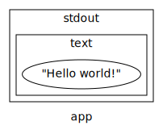

# Eolang-exercises

Object-oriented (OO) design is a very powerful approach for modelling real-world
problem domains, but out of the programming languages popularly thought of as
"OO", few readily lend themselves to authentic object thinking - at least, that
appears to be the rationale behind the development of
[eolang](https://github.com/cqfn/eo).

At first glance, the rhetoric seems far too familiar. Aggressive overselling -
_the future of OOP_, indeed - by way of catastrophism could well be mistaken 
for the bread and butter of marketing in our field. Or, as Glass pointedly put
it, ["Hype is the plague on the house of software."](https://www.goodreads.com/book/show/83792.Facts_and_Fallacies_of_Software_Engineering).
However, the developers follow up with an unusual reservation: They don't want 
their language to become mainstream. Instead, EO aims to be a tool for
demonstrating that "true" or "pure" OO is feasible.

This goal sure looks ambitious (and quite admirable, to be honest) - and given
the state of the typical project written in "OO" languages, I can definitely
empathise with their notion of inauthenticity. The paradigm is often criticised 
for design constructs that run in counter with the fundamental concepts, simply
because the program was implemented in, e.g., Java or C#.

Even if we ignore the philosophical aspects, eolang does look like a fun
puzzle. Picking up a new language is likely to alter some way of how you think
to approach some problem or another, but EO takes this a few steps further. The
syntax is obviously far from any C dialect and many common constructs (e.g.,
classes, mutability and operators) are forbidden by design.

Many of these constraints are bound to give rise to their fair share of
controversy. However, the central character -
[Yegor Bugayenko](https://www.yegor256.com/about-me.html), chairman of the
[International Conference on Code Quality (ICCQ)](https://www.iccq.ru) - ought
to hardly be a stranger to such disagreements: He has promoted and defended
these design principles for years and implemented them (discounting the
limitations of conventional languages) in more than a few open source projects.

But that's enough background. Let's get started!

## Hello world!

Tradition dictates that we begin with the one program that every programmer
knows: Print a hardcoded text to standard output. My solution in EO can be
found [here](./helloworld/eo/helloworld.eo)).
To compile and run the code, respectively, execute the following commands.

`mvn -f helloworld/pom.xml clean compile`

`java -cp helloworld/target/classes:helloworld/target/eo-runtime.jar org.eolang.phi.Main sandbox.app`

It's difficult to get a feel for a language from such a limited example, but
it still suffices to highlight a couple of thing of note. Besides some choices
in the language design (e.g., enforced indentation and no static typing
), we see three peculiar constructs: `[]`, `>` and `@`.

The first construct, `[]`, tells us what the object needs to know to do what it
does. In this case, the construct is empty because our program already knows
everything it needs to know. That is, all information required to print "Hello
world!" to standard output is already encapsulated in the `app` object.

Next, `>` is related to the previous construct. Similar to other arrows, it
directs the left operand into the one on the right. For instance, `[] > app`
can be understood as someone needs to know something (`[]` i.e., nothing) and
that someone is `app`. However, we also note that the operator is not only used
in conjunction with `[]`, for example on the line `stdout > @`.

Finally, the third construct, `@`, is EO's symbol for a decoration. For
example, we can interpret `stdout > @` as the enclosing object (`app`)
commiting to expanding its contact to include that of `stdout` - although `app`
will fulfill those parts by subcontracting `stdout`.

Next, having considered these three constructs in isolation, let us reassemble
the original program. It now becomes clearer that the primary hierarchy in
eolang - i.e., what the indentation emphasises - is encapsulation. Our program
is an object, `app`, that encapsulates a representation of standard output,
`stdout`, which in turn encapsulates a text, `"Hello world!"`. The equivalent
in a more conventional (pseudeo-)syntax, might look similar to below and is
illustrated in Fig 1.

```
class app {
  origin := new stdout(new text("Hello world!"));

  function apply() {
    origin.apply();
  }
}
```



What we see is that our inner-most objects are enclosed by another object that
provides just a thin sheet of functionality. Then that object, in turn, is
similarly enclosed. With each level, our model becomes richer and richer while
keeping each component small and managable.

From this point of view, we can see that EO has the nice property of being
lazy. The concern of constructing our program instance (i.e., `eo := new app()`
) is cleanly separated from the concern of execution (i.e., `eo.apply()`). Like
a clockwork toy of old, we prepare our program by winding it up and then, when
the time is right, we release it and let it live its own life.

Thus, our first EO exercise is concluded. So far, we've seen but a snippet of code, but already have we encountered a somewhat esoteric syntax and language constructs. Already, I think it's safe to say that EO will challenge your average programmer's cognition - and in a quite good way at that!

## Friends of Ten

Let's continue our exploration with a little maths game that is often used in
children's education: Friends of Ten. The exercise is nothing special - when
asked about a number [1, 9], respond with the number that would bring their sum
to 10 - but should introduce us to some important fundamentals for writing
useful programs. As opposed to our "Hello World!" program, let's go about this
is a slightly more structured way.

First, we create the simplest possible "Friend of Ten" we can imagine: A
program that neither validates input nor prints. The code for this program can
be found [here](./friendsoften/eo/friend.eo)).

Of course, we want to create some (unit) tests for this object. This requires
us to first add a dependency on JUnit in
[our POM file](friendsoften/pom.xml#L94-L98). Second, we create a small object
that encapsulates our test. In
[this example](./friendsoften/eo/tests/friendTest.eo), the test will determine
if our `friend` object can respond with the correct answer (i.e., `7`) when
asked who the pair of `3` is.

By compiling and executing our test (note the "Test" was appended to the method
name), we can see that the exit code indicates that the program could be run
successfully.

```
mvn -f friendsoften/pom.xml clean compile
java -cp friendsoften/target/classes:friendsoften/target/eo-runtime.jar org.eolang.phi.Main sandbox.pairThreeTest
echo $?
```

`mvn compile`

`java -cp target/classes:target/eo-runtime.jar org.eolang.phi.Main sandbox.app YEAR`

where `YEAR` is, e.g., 2020 or 2021.
